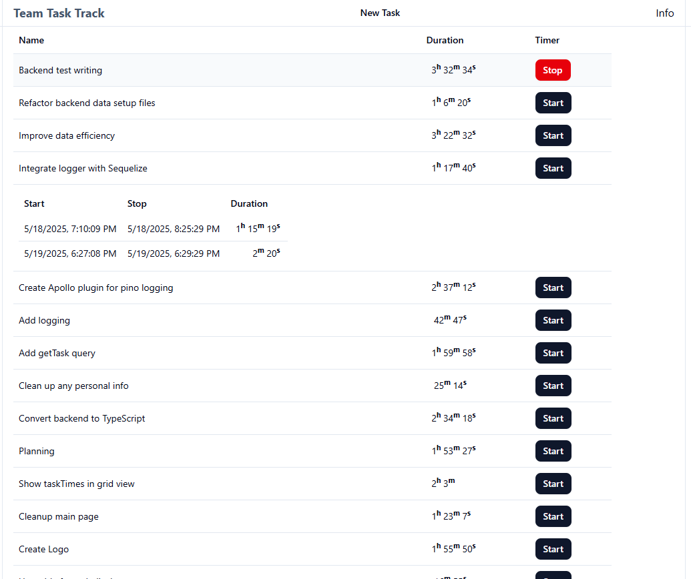

# Team Task Track



## Development

### Dependencies

#### Frontend

- Vite
- shadcn/ui: Uses Tailwind & Radix UI
- React & TypeScript
- Pino logger
- Jest
- Playwright

#### Backend

- Node.js & TypeScript
- Apollo server
- Apollo client (for testing)
- GraphQL
- Sequelize (ORM)
- Pino logger
- PostgreSQL
- Jest

### Installation

**Coming soon.**
_Quick notes for now:_

- Install PostgresQL.
- Create a main database.
- Create a test database, task_track_test, this name is hardcoded in server code to make sure that it is the only database that can be reset.
- Create a .env.dev and .env.test. See: .env.dev.example and .env.test.example
- run npm install in client, server, and playwright folders.
- **Note: Windows specific code**: in server there is a start_server.bat, which is used by the playwright tests. If not using windows change the playwright test to call: npm run testDevClean, via script or directly.

## Current Features

### Frontend

- Adding a Task with a name, which returns a new Task item that is added to the current Task list for display.
- Tasks are displayed in a table showing name, duration, or active duration for active tasks.
- Start task: creates a new TaskTime entry for that Task, with start (the current datetime). It also gets and displays the current task.
- Stop task: creates a stop entry in the current TaskTime row with the current datetime. It also gets and displays the current task.
- List time entries: By clicking on a task row, the task times for that task are loaded and displayed with start, stop, and duration (this name will probably be changed to interval in the near future).

### GraphQL backend

```GraphQL
  type Interval {
    milliseconds: Float
    seconds: Int
    minutes: Int
    hours: Int
    days: Int
    years: Int
  }

  type Task {
    id: Int!
    name: String!
    createdAt: String!
    updatedAt: String!
    duration: Interval
    active: Boolean!
    lastTime: String
    secondsDuration: Float
  }

  type TaskTime {
    id: Int!
    start: String!
    stop: String
    createdAt: String!
    updatedAt: String!
    taskId: Int!
    secondsDuration: Float
  }

  type Query {
    getTaskTimes(taskId: Int): [TaskTime]
    getTask(id: Int!): Task!
    getAllTasks: [Task!]!
  }

  type Mutation {
    createTask(name: String!): Task
    startTask(id: Int!): Task
    stopTask(id: Int!): Task
    deleteTask(id: Int!): Int
    changeTaskName(id: Int!, name: String!): Task
    stopServer: Int
  }
```

## Coming soon

- Projects
  - Adding a project table, so that we can group tasks by project
  - and define scopes per project
- Tasks
  - Changing Name
  - Deleting
  - Type field (feat, code, fix, ...)
  - Scope (adding and using pre project)
- Task Times
  - Adding comment
- Users
  - Authentication
  - Multi-user
